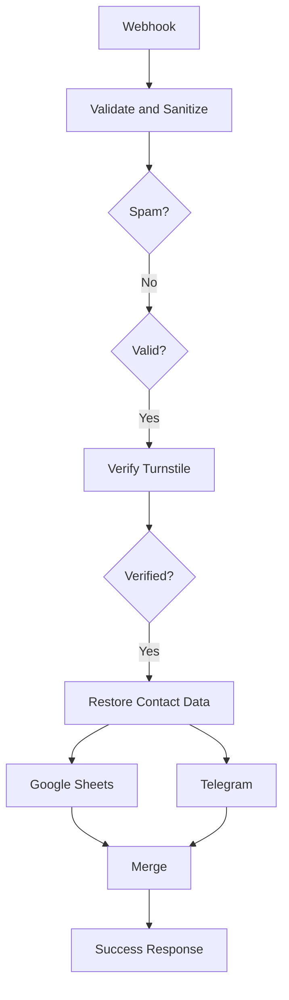

# Portfolio n8n Infrastructure

Render Blueprint and workflow documentation for the secure contact automation used by the Saurabh Choudhary portfolio.

## Related Project

- Portfolio repository: https://github.com/saurabhzaiswal/saurabh-portfolio
- Live portfolio: https://saurabhzaiswal.vercel.app
- Production n8n: https://n8n-service-71j0.onrender.com

## Purpose

This repository deploys a self-hosted n8n instance on Render using:

- Official n8n Docker image
- Render Web Service
- Render PostgreSQL
- Generated encryption key
- Automatically injected database credentials

## Repository Structure

```text
.
├── docs/
│   ├── contact-workflow.md
│   └── publishing-workflow-json.md
├── workflows/
│   └── portfolio-contact-form.sanitized.json
├── .gitignore
├── render.yaml
└── README.md
```

## Workflow




## Responsibilities

1. Receive the contact request.
2. Normalize and sanitize values.
3. Check the honeypot field.
4. Validate required fields.
5. Verify Cloudflare Turnstile.
6. Restore the sanitized contact payload.
7. Append the lead to Google Sheets.
8. Send a Telegram notification.
9. Merge branch outputs.
10. Return JSON to the Vue frontend.

## Branch Behaviour

```text
Restore Contact Data
├── Google Sheets
└── Telegram
```

These are separate workflow branches, but true parallel execution is not guaranteed. The Merge node waits for both configured inputs.

## Render Blueprint

The included `render.yaml` provisions:

```text
n8n-service
n8n-db
```

Image:

```text
docker.io/n8nio/n8n:latest
```

## Private Configuration

Do not commit:

```text
N8N_ENCRYPTION_KEY
DB_POSTGRESDB_PASSWORD
Google OAuth client secret
Telegram bot token
Telegram chat ID
Cloudflare Turnstile secret
```

## Workflow JSON

Only publish a sanitized export:

```text
workflows/portfolio-contact-form.sanitized.json
```

Keep raw exports outside Git or in ignored `workflows/raw/`.

See `docs/publishing-workflow-json.md`.

## Import

1. Deploy n8n.
2. Create the owner account.
3. Import the sanitized JSON.
4. Reconnect Google Sheets.
5. Reconnect Telegram.
6. Add the Turnstile secret.
7. Confirm CORS.
8. Publish the workflow.

## Free-Tier Limitations

- Render free services may sleep.
- First requests may be delayed.
- Free PostgreSQL can have retention or expiry limits.
- Maintain private backups.

## License

Infrastructure documentation for a personal portfolio project.
