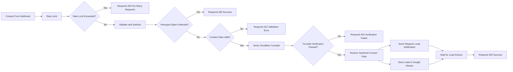

# Portfolio n8n Infrastructure

Render Blueprint and workflow documentation for the secure contact automation used by the Saurabh Choudhary portfolio.

## Related Project

- Portfolio repository: https://github.com/saurabhzaiswal/saurabh-portfolio
- Live portfolio: https://saurabhzaiswal.vercel.app
- Production n8n: https://n8n-service-71j0.onrender.com

## Purpose

This repository deploys a self-hosted n8n instance on Render using:

- Official n8n Docker image
- Render Web Service
- Render PostgreSQL
- Generated n8n encryption key
- Automatically injected database credentials
- Cloudflare Turnstile verification
- Per-IP workflow rate limiting
- Google Sheets lead storage
- Telegram lead notifications

## Repository Structure

```text
.
├── docs/
│   ├── contact-workflow.md
│   └── publishing-workflow-json.md
├── workflows/
│   └── portfolio-contact-form.sanitized.json
├── .gitignore
├── render.yaml
└── README.md
```

## Current Workflow




## Important Wiring Check

The intended honeypot routing is:

```text
Honeypot Spam Detected?
├── true  → Respond 200 Success
└── false → Contact Data Valid?
```

A spam submission must not continue to Turnstile, Google Sheets or Telegram.

## Workflow Responsibilities

1. Receive the contact request.
2. Extract the visitor IP and enforce a per-IP request limit.
3. Return HTTP `429` when the request limit is exceeded.
4. Normalize and sanitize submitted values.
5. Check the hidden honeypot field.
6. Return a generic success response for detected bots.
7. Validate required fields and field lengths.
8. Return HTTP `422` for invalid data.
9. Verify the Cloudflare Turnstile token server-side.
10. Return HTTP `403` when verification fails.
11. Restore the sanitized contact payload after the HTTP verification node replaces `$json`.
12. Store the verified lead in Google Sheets.
13. Send a Telegram lead notification.
14. Wait for the configured lead actions.
15. Return a structured success response to the Vue frontend.

## Rate Limiting

The workflow uses a Code node named `Rate Limit` and stores lightweight counters in workflow static data:

```js
const store = $getWorkflowStaticData("global");
```

Current policy:

```text
Maximum requests: 2
Window: 60 seconds
Key: visitor IP address
Exceeded response: HTTP 429
```

The `Rate Limit Exceeded?` node checks:

```js
{{ $json.rateLimited }}
```

### Limitations

This is suitable as a lightweight first layer for a low-traffic, single-instance portfolio workflow. It is not atomic or distributed. Simultaneous executions can race, and multiple n8n instances would require Cloudflare, Redis or PostgreSQL-backed enforcement.

## Branch Behaviour

```text
Restore Sanitized Contact Data
├── Send Telegram Lead Notification
└── Store Lead in Google Sheets
```

The `Wait for Lead Actions` Merge node waits for both configured inputs. True operating-system-level parallel execution is not guaranteed.

## HTTP Responses

| Status | Node | Meaning |
|---|---|---|
| `200` | `Respond 200 Success` | Submission accepted or generic bot response |
| `403` | `Respond 403 Verification Failed` | Turnstile verification failed |
| `422` | `Respond 422 Validation Error` | Submitted data failed validation |
| `429` | `Respond 429 Too Many Requests` | Per-IP request limit exceeded |
| `500` | n8n/integration failure | Unexpected workflow or integration failure |

## Render Blueprint

The included `render.yaml` provisions:

```text
n8n-service
n8n-db
```

Image:

```text
docker.io/n8nio/n8n:latest
```

## Private Configuration

Do not commit:

```text
N8N_ENCRYPTION_KEY
DB_POSTGRESDB_PASSWORD
Google OAuth client secret
Telegram bot token
Telegram chat ID
Cloudflare Turnstile secret
```

## Workflow JSON

Only publish a sanitized export:

```text
workflows/portfolio-contact-form.sanitized.json
```

Keep raw exports outside Git or in `workflows/raw/`.

## Import

1. Deploy n8n.
2. Create the owner account.
3. Import the sanitized workflow JSON.
4. Reconnect Google Sheets credentials.
5. Reconnect Telegram credentials.
6. Add the private Turnstile secret.
7. Replace placeholder IDs and domains.
8. Confirm the Webhook CORS origin.
9. Verify all node expressions after import.
10. Publish the workflow.
11. Test two allowed requests and one `429` response.
12. Test invalid, spam and failed-Turnstile paths.

## Render Environment

```env
N8N_HOST=n8n-service-71j0.onrender.com
N8N_PROTOCOL=https
N8N_EDITOR_BASE_URL=https://n8n-service-71j0.onrender.com/
N8N_WEBHOOK_URL=https://n8n-service-71j0.onrender.com/
N8N_PROXY_HOPS=1
GENERIC_TIMEZONE=Asia/Kolkata
TZ=Asia/Kolkata
NODE_OPTIONS=--max-old-space-size=384
```

## Free-Tier Limitations

- Render free services may sleep after inactivity.
- The first webhook request after inactivity may be delayed.
- Free PostgreSQL plans can have retention or expiry restrictions.
- Static-data rate limiting is not a distributed or atomic security control.
- Maintain private workflow exports and database backups.

## License

Infrastructure documentation for a personal portfolio project.
